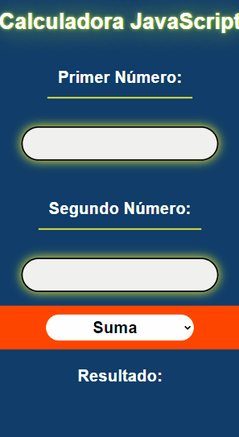
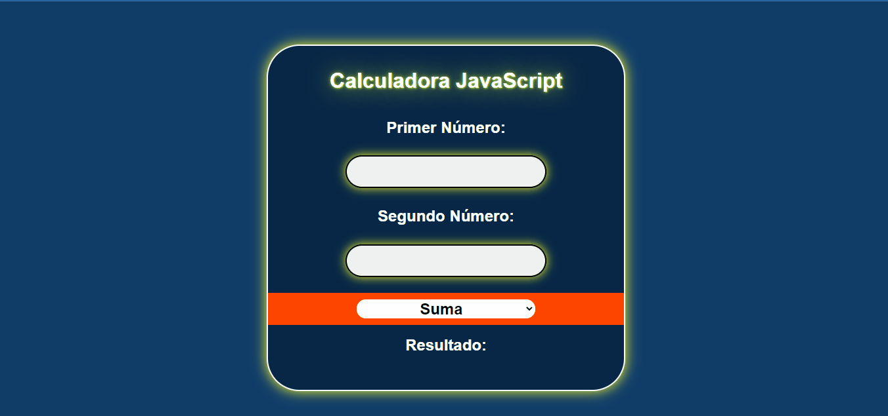

# JavaScript-calculator

Calculadora básica de dos números: suma, resta, multiplicación, división. Los resultados se muestra automáticamente cada vez que se deja de seleccionar el cuadro de entrada.

El objetivo principal fue poner en práctica mis conocimientos sobre _responsive design_ haciendo uso del diseño _mobile first_. Además de practicar el manejo del _DOM_ y eventos con _javaScript_, así como la inserción de contenido en el _HTML_ con _javaScript_. Finalmente, puse en práctica el uso de las ramas en _Git_, cree una segunda rama en donde subí los cambios antes de fusionarlos a la rama principal.

## Resultado final del proyecto

### Versión móvil



### Versión de escritorio



### Enlace a la aplicación

https://esdjl-javascript-calculator.netlify.app/

Tecnologías utilizadas

- HTML
- SCSS
- TypeScript

## Cómo realizar modificaciones

1. Clonar el repositorio:

```
git clone https://github.com/ESaulDJLaguna/JavaScript-calculator.git
```

2. Accede a la carpeta generada:

```
cd JavaScript-calculator
```

3. Instala las dependencias:

```
npm install
```

4. Transpila el archivo _styles.scss_. Esto generará los estilos _CSS_ y se mantendrá en modo observador.

```
npm run scss
```

5. En una nueva consola, compila el archivo _script.ts_. Esto generará el código _JavaScript_ y mantendrá al compilador en modo observador:

```
npm run ts
```

6. Abre el archivo _index.html_ en un navegador.

> Como recomendación, si se está usando Visual Studio Code, instala la extensión [Live Sever](https://marketplace.visualstudio.com/items?itemName=ritwickdey.LiveServer). Cada vez que se haga un cambio en el proyecto, no tendrá que actualizar manualmente la ventana del navegador.
